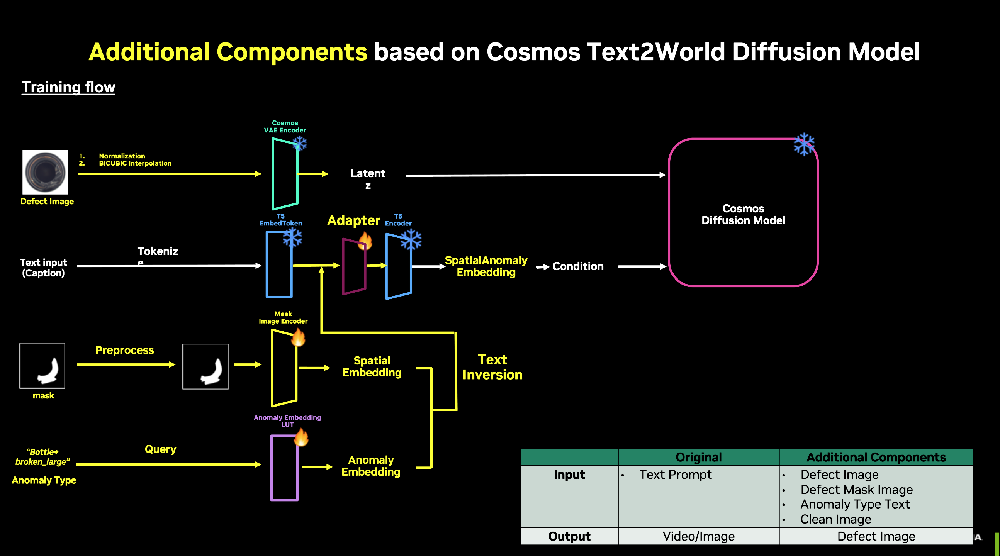
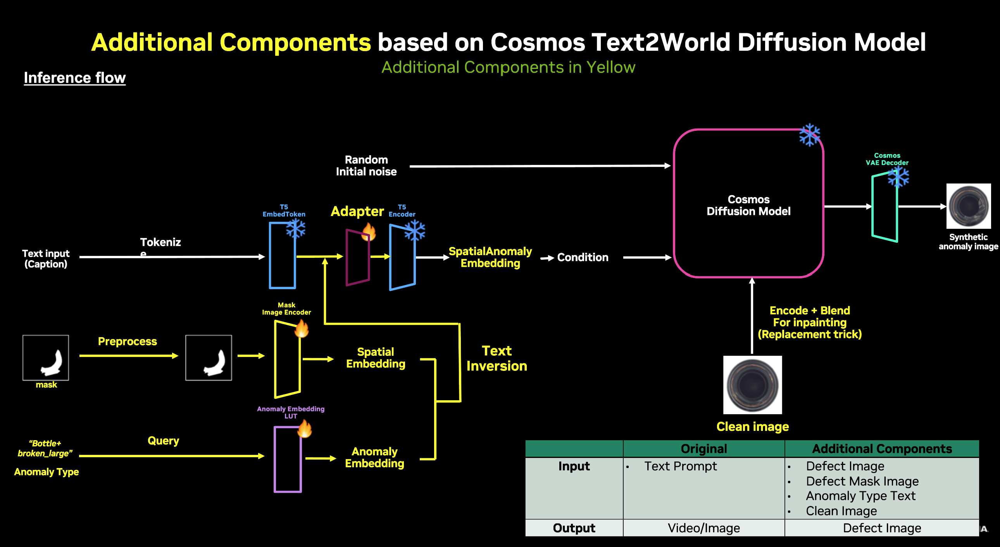
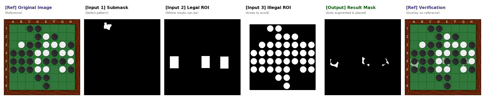
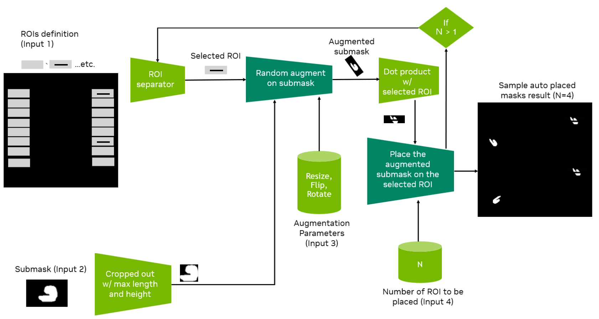
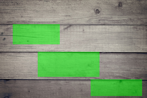
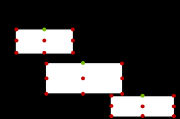
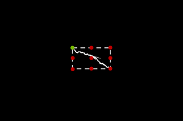
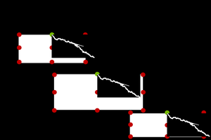
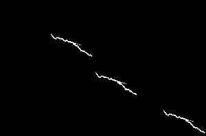

<!--
SPDX-FileCopyrightText: Copyright (c) 2026 NVIDIA CORPORATION & AFFILIATES. All rights reserved.
SPDX-License-Identifier: Apache-2.0

Licensed under the Apache License, Version 2.0 (the "License");
you may not use this file except in compliance with the License.
You may obtain a copy of the License at

http://www.apache.org/licenses/LICENSE-2.0

Unless required by applicable law or agreed to in writing, software
distributed under the License is distributed on an "AS IS" BASIS,
WITHOUT WARRANTIES OR CONDITIONS OF ANY KIND, either express or implied.
See the License for the specific language governing permissions and
limitations under the License.
-->

# PAIDF AnomalyGen

PAIDF AnomalyGen is a diffusion-based pipeline for Synthetic Data Generation (SDG) of anomaly images in a few-shot scenario.

## Overview

### Post-training

Cosmos-Predict2 natively supports text-to-image (T2I). Several additional network components enable extra inputs, such as mask and anomaly information. Because targets include a few-shot scenario, the diffusion network components (Cosmos-tokenizer, formerly known as VAE; T5 Text Encoder; Diffusion Transformer, or DiT) are frozen and only the additional components are trained.
The Cosmos-Predict2 Text-to-World (T2W) post-train pipeline was modified to retrieve gradients for updating these additional components.


### Inference



### Supported Cosmos-Predict2 Models

The following model sizes are supported:

* 2B T2I model
* 14B T2I model

## Requirements

- NVIDIA GPU + recent NVIDIA driver
- HuggingFace account with access to the Cosmos Predict2, T5, C-RADIOv3, DINOv2, SAM2 and Qwen3-VL model repos (see [Setup Checkpoints and HuggingFace Access](#setup-checkpoints-and-huggingface-access) below). NVDINOv2 is downloaded from NGC; SAM2 is downloaded from a public Facebook URL.
  - [https://huggingface.co/nvidia/Cosmos-Predict2-2B-Text2Image](https://huggingface.co/nvidia/Cosmos-Predict2-2B-Text2Image)
  - [https://huggingface.co/nvidia/Cosmos-Predict2-14B-Text2Image](https://huggingface.co/nvidia/Cosmos-Predict2-14B-Text2Image)
  - [https://huggingface.co/google-t5/t5-11b](https://huggingface.co/google-t5/t5-11b)
  - [https://huggingface.co/google-t5/t5-large](https://huggingface.co/google-t5/t5-large)
  - [https://huggingface.co/nvidia/C-RADIOv3-B](https://huggingface.co/nvidia/C-RADIOv3-B)
  - [https://huggingface.co/facebook/dinov2-large](https://huggingface.co/facebook/dinov2-large)
  - [https://huggingface.co/Qwen/Qwen3-VL-4B-Instruct](https://huggingface.co/Qwen/Qwen3-VL-4B-Instruct)
- Access to NV-DINOv2 from NGC.
  - [https://catalog.ngc.nvidia.com/orgs/nvidia/teams/tao/models/nv_dinov2_classification_model?version=trainable_v1.1](https://catalog.ngc.nvidia.com/orgs/nvidia/teams/tao/models/nv_dinov2_classification_model?version=trainable_v1.1)
- Access to SAM2 from Facebook.
  - [https://github.com/facebookresearch/sam2](https://github.com/facebookresearch/sam2)

## Installation

### Setup Checkpoints and HuggingFace Access

Download the checkpoints used by the pipeline before starting the tutorial notebooks. The setup script pulls Cosmos-Predict2 Text2Image (2B + 14B), google-t5 (large and 11b),NV-DINOv2, C-RADIOv3-B, facebook/dinov2-large, SAM2, and Qwen3-VL.

```shell
# Login into Huggingface (You have to prepare your own HF token)
hf auth login

python -m scripts.download_checkpoints --model_types text2image --model_sizes 2B 14B
```

`nvidia/Cosmos-Reason1-7B` is used by the pseudo-labeling captioner and is downloaded on-demand the first time you run pseudo labeling (or you can pre-fetch it by `hf download nvidia/Cosmos-Reason1-7B --local-dir checkpoints/nvidia/Cosmos-Reason1-7B`).

If the download script fails, you can manually download the checkpoints from the following links:

* NVDINOv2: [https://catalog.ngc.nvidia.com/orgs/nvidia/teams/tao/models/nv_dinov2_classification_model?version=trainable_v1.1](https://catalog.ngc.nvidia.com/orgs/nvidia/teams/tao/models/nv_dinov2_classification_model?version=trainable_v1.1) and place it in the `checkpoints/NVDINOV2` directory.
* C-RADIOv3-B: [https://huggingface.co/nvidia/C-RADIOv3-B/blob/main/model.safetensors](https://huggingface.co/nvidia/C-RADIOv3-B/blob/main/model.safetensors) and place it in the `checkpoints/nvidia/C-RADIO-V3` directory.

### Environment Setup (Conda)

For Conda environment setup, refer to [tutorial/notebooks/0-setup-cuda128.ipynb](tutorial/notebooks/0-setup-cuda128.ipynb).

### Environment Setup (Docker)

If you run into environment setup issues, we recommend building and running a Docker container for this project.

Use the `anomalygen-release` skill to build and validate CUDA 12.8 containers
from `Dockerfile-cuda128`. There are two modes:

- **Product container**: for users operating AnomalyGen through an agent. It sets
  `ANOMALYGEN_PRODUCT_MODE=1`, runs as a non-root user, locks production code
  read-only, and keeps runtime artifacts writable.
- **Develop container**: for developers using an agent to modify code. It leaves
  `ANOMALYGEN_PRODUCT_MODE` unset and keeps the repo writable.

Ask the agent:

```text
Build anomalygen product container
```

or:

```text
Build anomalygen develop container
```

Equivalent helper commands:

```bash
bash .agents/skills/anomalygen-release/scripts/build_image.sh --mode product
bash .agents/skills/anomalygen-release/scripts/build_image.sh --mode develop
```

After building, validate the intended mode:

```bash
bash .agents/skills/anomalygen-release/scripts/validate_image_permissions.sh \
    --mode product \
    "paidf-anomalygen:<Date>"

bash .agents/skills/anomalygen-release/scripts/validate_image_permissions.sh \
    --mode develop \
    "paidf-anomalygen-dev:<Date>"
```

Do not export `ANOMALYGEN_PRODUCT_MODE=1` in a normal clone or develop
container. That variable is reserved for product containers and is what enables
the AnomalyGen guard.

#### Running the Container

> **`--shm-size` is required.** PyTorch DataLoader uses `/dev/shm` for
> multiprocessing shared memory. The Docker default of 64 MB is far too small
> and will cause workers to crash with "Bus error" or silent hangs during
> training or inference. Use at least `16g`.

Product container:

```bash
TAG="paidf-anomalygen:<tag>"
REPO="$PWD"
HF_TOKEN=<your_token>
docker run --rm -it --gpus all --shm-size=16g \
    --user "$(id -u):$(id -g)" \
    -e USER="$(id -un)" \
    -e HF_TOKEN \
    -e HOME=/tmp \
    -v "${REPO}/checkpoints:/workspace/paidf-anomalygen/checkpoints" \
    -v "${REPO}/datasets:/workspace/paidf-anomalygen/datasets" \
    -v "${REPO}/ag_configs:/workspace/paidf-anomalygen/ag_configs" \
    -v "${REPO}/ag_inference:/workspace/paidf-anomalygen/ag_inference" \
    -v "${REPO}/results:/workspace/paidf-anomalygen/results" \
    -v /etc/passwd:/etc/passwd:ro \
    -v /etc/group:/etc/group:ro \
    -w /workspace/paidf-anomalygen \
    "${TAG}" \
    bash
```

Develop container:

```bash
TAG="paidf-anomalygen:<tag>"
REPO="$PWD"
HF_TOKEN=<your_token>
docker run --rm -it --gpus all --shm-size=16g \
    -e HF_TOKEN \
    -v "${REPO}:/workspace/paidf-anomalygen" \
    "${TAG}" \
    bash
```

#### Air-gapped Image

Air-gapped images have the checkpoints baked in.

Use the air-gapped variant when the target environment cannot reach the network
at runtime. All model checkpoints are baked into the image, so there are no volume mounts
needed. The resulting image is ~75 GB+.

Ask the agent:

```text
Generate airgapped docker image
```

The agent will check whether all required checkpoints are present in
`checkpoints/`, download any that are missing (requires `HF_TOKEN` exported),
and then build from `docker/Dockerfile.cuda128.airgapped`. You can also run the
helper directly:

```bash
# auto-downloads missing checkpoints then builds
bash .agents/skills/anomalygen-release/scripts/build_airgapped_image.sh --mode product

# if all checkpoints are already present
bash .agents/skills/anomalygen-release/scripts/build_airgapped_image.sh --mode product --skip-download
```

Run the air-gapped image, where no volume mounts are required:

```bash
docker run --gpus all -it --rm --shm-size=16g \
    paidf-anomalygen-airgapped:$(date -u +%Y%m%d) bash
```

To transfer to an air-gapped host:

```bash
# on the build host
docker save paidf-anomalygen-airgapped:<tag> | gzip \
    > paidf-anomalygen-airgapped-<tag>.tar.gz

# on the air-gapped host
docker load < paidf-anomalygen-airgapped-<tag>.tar.gz
docker run --gpus all -it --rm --shm-size=16g \
    paidf-anomalygen-airgapped:<tag> bash
```

### Shell Setup

Pipeline scripts live at `scripts/utilities/` and are referenced from the
skill through `${ANOMALYGEN_SCRIPTS}`. Inside the container this environment variable is
preset by the Dockerfile.

On the host, export it once per shell:

```bash
export ANOMALYGEN_SCRIPTS="$(git rev-parse --show-toplevel)/scripts/utilities"
```

`python3 -m scripts.utilities.<name>` invocations also work from the
repo root on the host or from anywhere inside the container
(`PYTHONPATH` is preset).

## Tutorial

Start from [tutorial/notebooks/0-setup-cuda128.ipynb](tutorial/notebooks/0-setup-cuda128.ipynb).

This series of tutorials walks you through the following steps:

1. Setting up the environment
2. Training the PAIDF AnomalyGen modules
3. (Optional) Automatic mask placement
4. Generating synthetic anomaly data
5. Pseudo-labeling on generated data

## Usage

### Dataset Preparation

#### Reference Datasets (UC1 / UC2 / UC3)

For the three reference use cases, refer to [`datasets/README.md`](datasets/README.md).
For how to obtain each dataset:

| UC | Subject | Get It |
|---|---|---|
| UC1 | PCB | Run `prepare_dataset_uc1.py` (auto-downloads from [`nvidia/Cosmos-AnomalyGen-PCB-Dataset`](https://huggingface.co/datasets/nvidia/Cosmos-AnomalyGen-PCB-Dataset) on Hugging Face) |
| UC2 | Metal surface | Run `prepare_dataset_uc2.py` (auto-downloads) |
| UC3 | Mobile phone screen | Manual download per [`PDF instructions`](datasets/UC3_dataset_download_instructions.pdf) → run `prepare_dataset_uc3.py --zip <…> --masks-from-hf` (masks + `defect_spec.jsonl` come from [`nvidia/Cosmos-AnomalyGen-Glass-Masks`](https://huggingface.co/datasets/nvidia/Cosmos-AnomalyGen-Glass-Masks)) |

#### Anomaly Type Categorization
* Before model training, categorize your anomaly dataset into several classes with "Texture" and "Anomaly type" information. We suggest you classify this using your domain knowledge. This step is **important** because it groups data with similar characteristics together. Categorize your data in a fine-grained manner. If you categorize data with diverse information together, it will increase the training difficulty and cause the model to generate low quality images.
    * For instance, the UC1 PCB dataset contains two visually distinct textures: `IC` and `passive_component`. The `IC` images have a single defect class `bridge`, while `passive_component` images have two: `excess_solder` and `missing`.
    * Therefore, the anomaly_types should be:
        - ['IC', 'bridge']
        - ['passive_component', 'excess_solder']
        - ['passive_component', 'missing']
* Your dataset must follow the anomaly type categorization shown below. For each anomaly image, it must include a paired mask image indicating where the anomaly occurred in the image.
    * Format
        * <DATASET_ROOT>
            * <TEXTURE_1>
                * anomaly_image
                    * <anomaly_type_1>
                        * image_1.jpg
                        * image_2.jpg
                        ...
                * mask
                    * <anomaly_type_1>
                        * image_1_mask.jpg
                        * image_2_mask.jpg
                        ...
    * Continuing with the UC1 example, the dataset should look like this:
        * datasets/UC1_data
            * IC
                * anomaly_image
                    * bridge
                        * image_1.jpg
                        ...
                * mask
                    * bridge
                        * image_1_mask.jpg
                        ...
            * passive_component
                * anomaly_image
                    * excess_solder
                        * image_1.jpg
                        ...
                    * missing
                        * image_1.jpg
                        ...
                * mask
                    * excess_solder
                        * image_1_mask.jpg
                        ...
                    * missing
                        * image_1_mask.jpg
                        ...
    * The image and mask pair should have exactly the same image size and the naming must also matched (mask image has suffix '_mask')

#### (Optional) TAO DAFT v3.0 Interop

Two helper scripts under `scripts/anomaly_gen/` provide the bridge between the `<component>/anomaly_image/<defect>/*.png` layout that the trainer expects and the NVIDIA TAO DAFT v3.0 specification. Pick the script that matches your use case.

**Preparing a DAFT dataset for post-training** — use `convert_from_daft_format.py` to turn a DAFT v3.0 scene into the `<component>/anomaly_image/<defect>/...` + `<component>/mask/<defect>/<basename>_mask.png` layout. The `scenario_info` field (`"component,defect,filename"`) on each image JSON drives the mapping and files under `task/` are flattened back to the split root.

```bash
python -m scripts.anomaly_gen.convert_from_daft_format \
--input datasets/my_dataset/val_daft_v3 --output datasets/my_dataset/val
# -> datasets/my_dataset/val/
#    ├── PCB/anomaly_image/{defect_1,defect_2,…}/…
#    ├── PCB/mask/{defect_1,defect_2,…}/…
#    └── validation.jsonl                  # was task/validation.jsonl
```

**Exporting generation results to DAFT v3.0** — use `convert_to_daft_format.py` on the inference output directory to produce a self-contained DAFT scene that downstream TAO tooling can consume. The input layout is auto-detected. There are two shapes supported:

1. An SDG inference-result directory containing `reconstructed_image/`, `original_mask/`, and `SDG_result.csv`.
2. A `<component>/anomaly_image/<defect>/*.png` labeled dataset, which is useful when you want to DAFT-ify a real training split as well.

```bash
# SDG inference output -> DAFT
python -m scripts.anomaly_gen.convert_to_daft_format \
--input results/.../example_output
--output results/.../example_output_daft_v3

# Labeled split -> DAFT, optionally carrying a validation/inference jsonl
python -m scripts.anomaly_gen.convert_to_daft_format \
--input datasets/my_dataset/val \
--output datasets/my_dataset/val_daft_v3 \
--validation-jsonl datasets/my_dataset/validation.jsonl
```

Default output is structured as:

```shell
<output>/raw/rgb/image_<N>.png          # canonical RGB (anomaly or reconstructed image)
<output>/raw/mask/image_<N>.png         # paired segmentation mask (same filename)
<output>/contextual/image_<N>.json      # v3.0 image schema; scenario_info = "component,defect,filename"
<output>/task/<jsonl-or-csv>            # --validation-jsonl / --inference-jsonl / SDG_result.csv copied verbatim
```

Validate using `tao-daft validate --path <output> --version 3.0 --raw image`.

### AnomalyGen Model Post-training

#### Prepare Your Config File for Training

Before post-training, specify your experiment configurations in a `.yaml` file.
You can use [ag_configs/MeiweiPCB_NVDINOV2_2B_512.yaml](ag_configs/MeiweiPCB_NVDINOV2_2B_512.yaml) and [.agents/skills/anomalygen/assets/ag_config.yaml](.agents/skills/anomalygen/assets/ag_config.yaml) as examples. You can also refer to [.agents/skills/anomalygen/references/finetune.md](.agents/skills/anomalygen/references/finetune.md) for more details.

The key sections of the config are:

- **`job`** — Specifies where your experiment results are stored (`{PROJECT}/{GROUP}/{NAME}`).
- **`optimizer`** — Configuration for the optimizer. Because the trainable parameters are usually very few, avoid setting `weight_decay` to a large value.
- **`checkpoint`** — `save_iter` controls how often a checkpoint is written, in training steps.
- **`trainer`** — Training-loop knobs:
  - `max_iter`: max training steps.
  - `logging_iter`: loss is printed every N steps.
- **`scheduler`** — Learning-rate scheduler config.
- **`dataloader_train`** — Training dataset:
  - `dataset.dataset_dir`: path to the organized dataset (see [Anomaly Type Categorization](#anomaly-type-categorization)).
  - `dataset.image_size`: model input resolution (square).
  - `dataset.anomaly_types`: list of `[TEXTURE, ANOMALY_TYPE]` pairs — must match the directory layout.
  - `data_augprob`: probability of triggering augmentation (0.5 recommended).
  - `aug_type`: augmentation kind. Use `random_ratio_crop`.
  - `ratio_range`: crop ratio range when `aug_type=random_ratio_crop` (e.g., `1.5 8.0`).
- **`model`** — Model components: `anomaly_embedding`, `mask_encoder`, `adapter`, `text_encoder`.

#### Training Command

##### Training 2B Pipeline

```bash=
torchrun --nproc_per_node=1 --master_port=12341 -m scripts.anomaly_gen.ag_train \
--config=cosmos_predict2/configs/base/ag_config.py \
--ag_config {YOUR_CONFIG}.yaml \
-- experiment=predict2_anomaly_gen_ddp_2b
```

##### Training 14B Pipeline

```bash=
torchrun --nproc_per_node=1 --master_port=12341 -m scripts.anomaly_gen.ag_train \
--config=cosmos_predict2/configs/base/ag_config.py \
--ag_config {YOUR_CONFIG}.yaml \
-- experiment=predict2_anomaly_gen_ddp_14b
```

* The required training time varies from dataset to dataset. Because there is no reliable convergence metric, use an image-logging callback to visually assess whether the model is well-trained.
* For the UC1 dataset, the model trained for 14000 steps with `batch_size=2` and `lr=2e-2`.

##### Multi-GPU Training (Experimental)

To enable training on multiple GPUs (for example, 8 GPUs):

Update the launch command:

```bash=
torchrun --nproc_per_node=8 --master_port=12341 -m scripts.anomaly_gen.ag_train \
--config=cosmos_predict2/configs/base/ag_config.py \
--ag_config {YOUR_CONFIG}.yaml \
-- experiment=predict2_anomaly_gen_ddp_2b
```

Note that the effective batch size is `batch_size * num_gpus`. You should also consider modifying the learning rate accordingly.

### Batch Inference for SDG

#### Prepare Your SDG Configuration

The SDG process is split into two steps: 

* Testcase preparation
* Batch inference

##### Testcase Preparation

In this step, prepare a `.jsonl` file that specifies all the configurations that will be used to generate synthetic data. One line represents one generation.
The codebase supports different kinds of augmentation. One augmentation option is to randomly form combinations of arguments.

You can use any method you want to create this `.jsonl` file. An example script for the MIIC dataset is provided:

```bash=
python -m scripts.anomaly_gen.create_testcase --OK_image_path datasets/UC1_data/IC/clean_image --NG_mask_path datasets/UC1_data/IC/mask --name UC1
```

After running this, an example of the testcase will be generated at `ag_inference/UC1/testcase_16x_guidance=7.0_crop_ratio=2.0_poisson_blend=False.jsonl`.

```jsonl=
{"image_filename": "datasets/UC1_data/IC/clean_image/IC_00201.jpg", "mask_filename": "datasets/UC1_data/IC/mask/bridge/IC_00002_mask.jpg", "anomaly_type": "IC+bridge", "guidance": 5.0, "num_steps": 35, "crop_and_paste": true, "crop_ratio": 1.0, "crop_grid_X": "none", "crop_grid_Y": "none", "num_generated_images": 1, "poisson_blend": false, "shift_values": "-34,-6", "rotation_angle": 32, "morph_operation": "open", "iteration_generation_max_instance": 1}
{"image_filename": "datasets/UC1_data/passive_component/clean_image/pc_00689.jpg", "mask_filename": "datasets/UC1_data/passive_component/mask/excess_solder/pc_00002_mask.jpg", "anomaly_type": "passive_component+excess_solder", "guidance": 7.0, "num_steps": 35, "crop_and_paste": true, "crop_ratio": 1.5, "crop_grid_X": "none", "crop_grid_Y": "none", "num_generated_images": 1, "poisson_blend": false, "shift_values": "-93,-80", "rotation_angle": 35, "morph_operation": "close", "iteration_generation_max_instance": 1}
```

> **Note:**
    - Augmentation should be used with care. For instance, some of the anomalies are location-dependent (bridging occurs only across IC pin), in this case, you should not be using shifting unless you have confirmed that the shifted position is also reasonable for growing anomalies.
    - `crop_ratio` and `crop_grid_*` are mutually exclusive. When `crop_ratio` is provided, `crop_grid_*` will be ignored.
    - All fields must be provided with values in configurations.

##### Definition on Generation Configurations

###### Required Field

* image_filename: Path to clean image for inpainting. Required.
* mask_filename: Path to plotted mask indicating where the anomaly should grow. Required.
* anomaly_type: The anomaly type this anomaly belongs to. Should align to the setting during post-training. Format: <TEXTURE>+<ANOMALY_TYPE>, for instance, "IC+bridge"

###### Optional Fields

Skip these fields to use default values.

* **Diffusion Process**
    * guidance: Float = 1.5. Guidance for controlling the strength of anomaly condition guidance. Float
    * seed: int = 1. Seed to control sampling in the initial latent noise for diffusion process.
    * num_steps: int = 35. Denoise steps executed for each data.
    * num_generated_images: int = 1. Number of images generated for this data. For instance, when setting to `4`, four images will be generated under the same configuration. However, because their initial latents will not be the same, the generated images still have randomness. Batch operation has higher efficiency.
* **Crop and Paste**
    * crop_and_paste: bool = True. Whether to use crop and paste flow or not.
    * crop_grid_X: int = None. Size of Cropped grid in x-axis.
    * crop_grid_Y: int = None. Size of Cropped grid in y-axis.
    * crop_ratio: float = None. The ratio for cropping grid compared to masked region's bbox. When enabled, `crop_grid_*` will be deactivated.
    * poisson_blend: bool = False. Whether to use poisson blending when pasting back to a clean image.
* **Mask Augmentation**
    * shift_values: str = None. The shifted value for masked region (Format: <X>,<Y> split by comma).
    * rotation_angle: int = None. The rotated angle for masked region.
    * morph_operation: str = None. The morph options for mask. Supports: ['dilate', 'erode', 'open', 'close'].
    * iterative_generation_max_instance: int = 5. Maximum number of instances to iteratively generate for a single image.

##### Batch Generation

After preparing the test cases, use the following script for generation. This script strictly follows the configuration specified in the test case and does not involve any randomness.

###### 2B Pipeline Generation

```bash=
time \
torchrun --nproc_per_node=1 -m scripts.anomaly_gen.synthetic_dataset_generation \
--config=cosmos_predict2/configs/base/ag_config.py \
--ag_checkpoint_dir <YOUR_CHECKPOINT_DIR> \
--step 75000 \
--input_data_path <YOUR_TESTCASE>.jsonl \
--output_image_path <YOUR_OUTPUT_PATH> \
--seed 0 \
-- experiment=predict2_anomaly_gen_ddp_2b
```

###### 14B Pipeline Generation

```bash=
time \
torchrun --nproc_per_node=1 -m scripts.anomaly_gen.synthetic_dataset_generation \
--config=cosmos_predict2/configs/base/ag_config.py \
--ag_checkpoint_dir <YOUR_CHECKPOINT_DIR> \
--step 75000 \
--input_data_path <YOUR_TESTCASE>.jsonl \
--output_image_path <YOUR_OUTPUT_PATH> \
--seed 0 \
-- experiment=predict2_anomaly_gen_fsdp_14b
```

###### Multi-GPU Inference

For larger SDG batches, the same generation entrypoint also supports rank-sharded multi-GPU inference. Each rank loads the same checkpoint, consumes a disjoint subset of the testcase rows, and rank `0` merges the generated metadata into a single `SDG_result.csv` and `timing_summary.json` under `--output_image_path`.

During inference, the script automatically disables Fully Sharded Data Parallel (FSDP) and uses one process per GPU for rank sharding, so you can reuse the same post-training checkpoint and testcase JSONL that are used for single-GPU runs.

Example (8 GPUs, 2B pipeline):

```bash=
time \
torchrun --nproc_per_node=8 --master_port=12341 -m scripts.anomaly_gen.synthetic_dataset_generation \
--config=cosmos_predict2/configs/base/ag_config.py \
--ag_checkpoint_dir <YOUR_CHECKPOINT_DIR> \
--step 75000 \
--input_data_path <YOUR_TESTCASE>.jsonl \
--output_image_path <YOUR_OUTPUT_PATH> \
--num_workers 4 \
--seed 0 \
-- experiment=predict2_anomaly_gen_fsdp_2b
```

> **Note:**
    - Use `--nproc_per_node` equal to the number of GPUs you want to participate in inference.
    - Make sure all ranks can access the same testcase JSONL and output directory path.
    - `timing_summary.json` reports the aggregated wall-clock timing across ranks, while `SDG_result.csv` contains the merged generated-image rows from all ranks.
    `--ref_root` is optional. If specified, the script computes experimental distribution metrics between SDG and reference images and saves them to `SDG_metrics.csv`. The reference images should follow the same format as the training data.

### KPI Evaluation and Filtering

#### Evaluate Generated Datasets

Use `scripts/anomaly_gen/evaluate.py` to compute the same Frechet Inception Distance (FID) metric logged during validation runs.

Required arguments:

- `--real_path`: matches `dataloader_train.dataset.dataset_dir` in your training config.
- `--generated_path`: matches the `--output_image_path` used during generation.
- `--anomaly_types`: list of `TEXTURE+TYPE` tokens covering every anomaly type in the dataset.

> **Note:** FID computation requires more than two samples per anomaly type in both the real and generated sets.

Example:

```bash
python -m scripts.anomaly_gen.evaluate \
    --real_path datasets/UC1_data \
    --generated_path results/UC1/example_output \
    --anomaly_types IC+bridge \
                    passive_component+excess_solder \
                    passive_component+missing
```

#### Filter Generated Samples

Use `scripts/anomaly_gen/filter.py` to split SDG results into keep or drop buckets based on sample-wise Generated Image Quality Assessment (G-IQA) scores.

Required arguments:

- `--real_path`: matches `dataloader_train.dataset.dataset_dir` in the training config.
- `--generated_path`: matches the `--output_image_path` used during generation.
- `--anomaly_types`: list of `TEXTURE+TYPE` tokens covering every generated anomaly type.
- `--output_path`: destination directory for filtered artifacts.
- `--drop_ratio`: fraction of samples to discard per anomaly type (for example, `0.2` keeps 80%).

Optional arguments:

- `--rotation_range`: rotation `min max` in degrees for real image augmentation (disable with `0 0`).
- `--rotation_step`: increment in degrees applied within the rotation range.

Outputs:

```text
<output_path>/
├── keep/
│   ├── reconstructed_image/
│   ├── original_mask/
│   ├── original_image/
│   └── SDG_result.csv
├── drop/
│   ├── reconstructed_image/
│   ├── original_mask/
│   ├── original_image/
│   └── SDG_result.csv
└── filter_result.csv
```

`keep/` holds retained samples, `drop/` stores discarded ones, and `filter_result.csv` summarizes scores for all files.

Example:

```bash
python -m scripts.anomaly_gen.filter \
    --real_path datasets/UC1_data \
    --generated_path results/UC1/example_output \
    --output_path results/UC1/filter \
    --drop_ratio 0.2 \
    --anomaly_types IC+bridge \
                    passive_component+excess_solder \
                    passive_component+missing
```

### Pseudo Labeling

A script is available to generate pseudo labels for the generated data. This is helpful when you want to use the generated data to train a downstream task model, especially with the TAO toolkit. This script also includes a Cosmos-Reason 1 7B-based captioner to generate captions for the generated images.

The workflow is as follows:

1. **Data Loading**: Loads the original images, original masks, generated images, and a CSV file containing the generation details.
2. **Mask Clustering**: Clusters the masks using Density-Based Spatial Clustering of Applications with Noise (DBSCAN) to group neighboring anomalies together.
3. **Bbox and RLE Computation**: Computes bounding boxes and run-length encoding (RLE) for each clustered mask in COCO format.
4. **Captioning**: Uses the Cosmos-Reason 1 7B model to generate captions for the generated images based on a provided prompt.
5. **Organization**: Organizes the outputs for downstream tasks.

Available arguments for the pseudo-labeling script are:

- `ori_image_dir`: The directory containing the original clean images used for generation.
- `gen_image_dir`: The directory containing the generated anomaly images.
- `mask_dir`: The directory containing the masks used for generation.
- `csv_path`: The path to the CSV file which is generated by PAIDF AnomalyGen.
- `caption_prompt_path`: The path to the caption prompt file used by the captioner. If not provided, a default prompt will be used. Refer to `pseudo_label/default_caption_prompt.yaml` for the details.
- `output_dir`: The directory where the pseudo-labeled data will be saved.
- `no_caption`: If set, the captioning step will be skipped. This saves time if captions are not needed.
- `dbscan_eps`: DBSCAN epsilon (eps) parameter for clustering masks. Default is `0.2`.
- `dbscan_min_samples`: DBSCAN `min_sample` parameter for clustering masks. Default is `5`.
- `captioner_num_gpus`: The number of GPUs to use for the captioning process. More GPUs can speed up the process. Default is `1`.
- `captioner_temperature`: Captioner temperature parameter for generating captions. Default is `0.01`.
- `captioner_max_tokens`: Captioner max_tokens parameter for generating captions. Default is `4096`.
- `captioner_seed`: Captioner seed parameter for generating captions. Default is `42`.

The supported image formats are `.jpg`, `.jpeg`, `.png`, `.bmp`, and `.tiff`.

The mask values should be either 0 (background) or 255 (anomaly region). Specifically, the mask is binarized with a threshold of 127 (`binary_mask = (mask > 127)`).

>**Note**:
When you run the pseudo-labeling process for the first time, the system downloads the Cosmos-Reason model and saves it to `./checkpoints`, just like the PAIDF AnomalyGen model. This may take some time depending on your network speed.

>**Important**:
The quality of the generated captions may vary. Create a custom prompt tailored to your specific dataset and use case, because it can significantly improve the relevance and accuracy of the captions generated by the captioner.

Example usage:

```bash
python -m scripts.anomaly_gen.pseudo_label \
    --ori_image_dir=results/UC1/example_output/original_image \
    --gen_image_dir=results/UC1/example_output/reconstructed_image \
    --mask_dir=results/UC1/example_output/original_mask \
    --csv_path=results/UC1/example_output/SDG_result.csv \
    --output_dir=results/UC1/pseudo_labeling \
    --captioner_num_gpus=1
```

### Automatic Mask Placement

#### Motivation

The existing augmentation capabilities in PAIDF AnomalyGen (available in **Batch Inference for SDG** and **Testcase Preparation**) apply transformations to entire mask images. While this approach works well for scattered defects that can appear arbitrarily across the whole image, it has limitations for more complex use cases, such as:

- **Repeated and ordered foreground objects**: Products with multiple identical components (for example, circuit boards, pharmaceutical packaging).
- **Defects on specific foreground objects**: Anomalies that only occur on particular regions or parts (for example, scratches on specific panels).
- **Defects with specific shapes**: Anomalies that need to maintain particular geometric patterns (for example, cracks, alignment issues).
- **Restricted ROIs (Regions of Interest)**: Cases where defects can only appear in defined legal regions and must avoid certain forbidden areas.

The Automatic Mask Placement tool addresses these limitations by providing an additional layer of data augmentation for mask generation. It allows you to automatically place and augment submasks within predefined regions of interest (ROIs), creating diverse variations for enhanced dataset quality with precise spatial control.

#### User Guide

For a detailed user guide with use cases, refer to the Auto Mask-Placement (AMP) GUI Tutorial.

#### GUI Interface

The Automatic Mask Placement GUI is the **primary and recommended interface** for most users.
It provides visualization and interactive control, making it the most efficient way
to design, debug, and validate mask placement strategies.

The CLI interface is intended for batch processing and fully reproducible large-scale generation
after configurations have been verified through the GUI.

To start the GUI server:

```bash
AMP_PORT=5000 python3 -m amp_gui.backend.app
```

`AMP_PORT` specifies the port number on which the GUI backend server listens.
If not explicitly set, the backend will use its default port 5000.

After starting the server, open a web browser and navigate to:
```
http://localhost:<AMP_PORT>
```

#### Example Use Case: Reversi Board Inspection

Consider a scenario where masks should only appear around black game pieces but must avoid overlapping with any chess pieces:

**Scenario Definition:**

1. **Submask (Input 1)**: The defect pattern to be placed
   - Example: [`reversi_sample_submask.png`](assets/anomaly_gen/auto_mask_placement_example_materials/reversi_example/submask/reversi_sample_submask.png)
2. **Legal ROIs (Input 2)**: Define regions around black pieces where masks can appear using JSON bounding boxes
   - Example: [`reversi_sample_rois.json`](assets/anomaly_gen/auto_mask_placement_example_materials/reversi_example/rois/json/reversi_sample_rois.json)
3. **Illegal ROIs (Input 3)**: Define all chess piece locations as forbidden areas to prevent overlap
   - Example: [`reversi_sample_illegal_region.png`](assets/anomaly_gen/auto_mask_placement_example_materials/reversi_example/rois/image/illegal/reversi_sample_illegal_region.png)

**Example Visualization:**



The visualization demonstrates the complete example workflow from inputs to output:
- **[Ref] Original Image**: Reference image for visualization purposes (Reversi board)
- **[Input 1] Submask**: The defect pattern to be placed
- **[Input 2] Legal ROI**: Regions around black pieces where masks can be placed (white areas from JSON)
- **[Input 3] Illegal ROI**: All chess piece locations that must be avoided (white areas from binary image)
- **[Output] Result Mask**: Auto augmented and placed - submask transformed and positioned in valid regions
- **[Ref] Verification**: White semi-transparent overlay on reference image confirms correct placement

#### Workflow Overview



The automatic mask placement follows a systematic workflow:

1. **Input Processing**: Binary ROIs define legal and illegal placement regions, submask provides the defect pattern, augmentation parameters control transformations, and N specifies number of instances to generate.
2. **ROI Separation**: Extract and separate individual ROI regions from the combined binary ROI image.
3. **Submask Cropping**: Crop the submask to its minimal bounding box containing the actual defect.
4. **Random Augmentation**: Apply transformations (resize, flip, rotate, morphological operations) to the cropped submask.
5. **Dot Product with ROI**: Ensure the augmented mask only appears within legal ROI boundaries.
6. **Placement**: Position the processed mask onto the whole binary ROI canvas.
7. **Iteration**: Repeat steps 2-6 until N instances are generated.

Available arguments for the automatic mask placement script are:

#### Required Parameters

- `--submask` **(required)**: Path to the binary submask image to be placed.
- `--output_base_dir` **(required)**: Base output directory (subdirectories created for each seed).

**ROI Definition (at least one required):**

- `--rois`: JSON file containing ROI definitions.
- `--roi_image`: Binary image(s) defining legal regions (white = legal).

**Instance Count (at least one required):**

- `--n`: Number of instances to generate (fixed for all seeds).
- `--n_range MIN MAX`: Random N range - each seed gets a random N value in [MIN, MAX].

**Seed Control (mutually exclusive, one required):**

- `--seed`: Single seed value (use `"None"` for random behavior, enables real-time output). Default: random.
- `--seed_range START END`: Seed range for batch generation (for example, `1 20` generates seeds 1-20).
- `--seed_list "S1,S2,..."`: Specific seed list (for example, `"1,5,10,42"`).

#### Optional Parameters

**Illegal ROI (optional):**

- `--illegal_roi_image`: Binary images defining forbidden regions (white = illegal).

**Alignment Options (optional):**

- `--roi_alignment_point`: Where to align mask within ROI. Options: `center`, `top_left`, `top_right`, `bottom_left`, `bottom_right`, `top_center`, `bottom_center`, `left_center`, `right_center`, `random`. Default: `center`.
- `--submask_alignment_point`: Fixed point for submask augmentation (same options as above). Default: `None` (no fixed alignment).
- `--strict_alignment`: Disable shifting to prevent boundary clipping (intelligently allows safe flips based on alignment point). Default: `False`.

**Output Control (optional):**

- `--save_visualize`: Save ROI visualization overlay.
- `--save_roi_binaries`: Save binary images of processed ROIs.
- `--save_separated_rois`: Save individual ROI masks.
- `--save_cropped_submask`: Save the cropped submask before augmentation.
- `--save_augmented_masks`: Save intermediate augmented masks.

**Batch Processing (optional):**

- `--parallel_workers`: Number of parallel processes for batch generation. Default: `1` (sequential).
- `--output_naming`: Output organization strategy. Options: `seed_subdir` (creates subdirectories) or `seed_suffix` (adds seed to filenames). Default: `seed_subdir`.

**Other Options (optional):**

- `--aug_config`: Path to custom augmentation configuration JSON file.
- `--min_area`: Minimum ROI area threshold for filtering small regions. Default: `10`.

#### ROI Definition Methods

**JSON-based ROI Definition:**

Create a JSON file defining rectangular regions:

```json
{
  "rois": [
    {
      "bbox": {"x": 100, "y": 100, "width": 200, "height": 150},
      "is_legal": true,
      "roi_id": "region_1"
    },
    {
      "bbox": {"x": 400, "y": 200, "width": 180, "height": 120},
      "is_legal": true,
      "roi_id": "region_2"
    }
  ]
}
```

**Image-based ROI Definition:**

Use binary images where:

- **Legal ROI images**: White pixels (255) indicate where masks can be placed.
- **Illegal ROI images**: White pixels (255) indicate forbidden areas that will be subtracted from legal regions.

#### Usage Modes

The tool supports two modes:

**Single Mode**: Generates one output mask with real-time console output.

    - Use `--seed <value>` or `--seed None` for a single seed
    - Creates one subdirectory (for example, `seed_0001/`) with one result mask
    - Ideal for testing and debugging

**Batch Mode**: Generates multiple output masks for different seeds.

    - Use `--seed_range <start> <end>` or `--seed_list "<seed1>,<seed2>,..."`
    - Creates multiple subdirectories, each with one result mask
    - Supports parallel processing with `--parallel_workers`
    - Ideal for large-scale dataset generation

Example usage:

#### Single Generation (with seed)

```bash
python3 -m scripts.anomaly_gen.automatic_mask_placement \
    --submask path/to/your/submask.png \
    --n 4 \
    --rois path/to/roi_definitions.json \
    --output_base_dir results/mask_placement/single \
    --seed 42
# Output: results/mask_placement/single/seed_0042/auto_placed_mask_with_4_rois_seed_42.png
```

#### Batch Generation with Seed Range

```bash
python3 -m scripts.anomaly_gen.automatic_mask_placement \
    --submask path/to/your/submask.png \
    --n 4 \
    --rois path/to/roi_definitions.json \
    --output_base_dir results/mask_placement/batch \
    --seed_range 1 20 \
    --parallel_workers 4
# Output: 20 masks in separate directories
#   results/mask_placement/batch/seed_0001/auto_placed_mask_with_4_rois_seed_1.png
#   results/mask_placement/batch/seed_0002/auto_placed_mask_with_4_rois_seed_2.png
#   ...
#   results/mask_placement/batch/seed_0020/auto_placed_mask_with_4_rois_seed_20.png
```

#### Advanced Options

The tool provides advanced features for detailed analysis and specialized use cases:

**Intermediate Output and Visualization**: Save intermediate processing steps for debugging and analysis.

    - `--save_visualize`: ROI visualization overlay
    - `--save_roi_binaries`: Binary images of processed ROIs
    - `--save_separated_rois`: Individual separated ROI masks
    - `--save_cropped_submask`: Cropped submask before augmentation
    - `--save_augmented_masks`: Augmented masks at each generation step

**Mask Alignment Control**: Precise positioning for specific use cases (for example, corner-aligned defects, edge-aligned scratches).

    - `--roi_alignment_point`: Control where masks are positioned within ROI (center, corners, edges, random)
    - `--submask_alignment_point`: Fixed reference point for submask transformations
    - `--strict_alignment`: Disable shifting and limit flipping to prevent boundary clipping

##### Understanding Alignment: Wood Crack Example

**Scenario**: Place crack defects along wood seams, ensuring cracks attach to seam edges even after augmentation.

| Step | Description | Visualization |
|------|-------------|---------------|
| 1. ROI Definition | Define ROIs along wood seam edges (green overlay) |  |
| 2. ROI Alignment Point Selection | Select `top_center` (green point) as ROI anchor |  |
| 3. Submask Alignment Point Selection | Select `top_left` (green point) on cropped mask boundary |  |
| 4. Alignment Schematic | How alignment points connect |  |
| 5. Result Mask | Result masks placed at aligned positions |  |
| (6. Verification) | Semi-transparent overlayed result masks |  |

> **Note**: 
> - Use `--save_cropped_submask` to verify cropped mask shape before selecting submask alignment points.
> - Use `--strict_alignment` to disable shifting and limit flipping to safe directions only, ensuring precise point-to-point alignment (essential for scenarios like this where cracks must connect to seam edges).

The tool maintains this alignment relationship during augmentation (rotation, scaling, shearing operations).

**Example Command**:

```bash
# Wood crack placement with alignment
python3 -m scripts.anomaly_gen.automatic_mask_placement \
    --submask assets/anomaly_gen/auto_mask_placement_example_materials/wood_example/submask/wood_crack_submask.png \
    --roi_image assets/anomaly_gen/auto_mask_placement_example_materials/wood_example/rois/image/legal/legal_rois_binary.png \
    --n 3 \
    --output_base_dir results/mask_placement/wood_alignment \
    --seed 42 \
    --roi_alignment_point top_center \
    --submask_alignment_point top_left \
    --strict_alignment \
    --save_cropped_submask \
    --save_augmented_masks \
    --save_visualize
```

#### Augmentation Configuration

By default, you don't need to configure augmentation parameters. The tool provides an automated experience with **dynamic defaults** that intelligently determine reasonable augmentation ranges based on your submask and ROI characteristics.

However, if you need fine-grained control over augmentation behavior for specific requirements, you can provide a custom configuration file.

**Key Parameters:**

| Parameter | Default Behavior | Description | Example Custom Value |
|-----------|------------------|-------------|---------------|
| `shift_x_range` / `shift_y_range` | Dynamic (auto-calculated) | Pixel shift range for mask translation | `[-10, 10]` |
| `rotation_range` | Dynamic (auto-calculated) | Rotation angle range in degrees | `[-15, 15]` |
| `shear_range` | Dynamic (auto-calculated) | Shear transformation range in degrees | `[-5, 5]` |
| `scale_range` | `[0.8, 1.2]` | Scale factor range for mask resizing | `[0.9, 1.1]` |
| `flip_x_probability` | `0.5` | Probability of horizontal flip | `0.3` |
| `flip_y_probability` | `0.5` | Probability of vertical flip | `0.3` |
| `shift_probability` | `1.0` | Probability of applying shift (disabled with `--strict_alignment`) | `0.8` |
| `rotation_probability` | `1.0` | Probability of applying rotation | `0.8` |
| `shear_probability` | `1.0` | Probability of applying shear | `0.5` |
| `scale_probability` | `1.0` | Probability of applying scaling | `0.8` |
| `morph_operations` | `['dilate', 'erode', 'open', 'close']` | Morphological operations to apply | ['dilate', 'erode'] |
| `morph_kernel_size` | `3` | Kernel size for morphological operations | `5` |
| `morph_probability` | `1.0` | Probability of applying morphological ops | `0.5` |

**How Dynamic Defaults Work:**

- Analyzes submask dimensions and ROI sizes to calculate safe transformation ranges
- Automatically limits transformations to keep augmented masks within ROI boundaries
- No manual tuning required for most use cases

**Example Configuration File** (`augmentation_config.json`):

```json
{
  "shift_x_range": [-20, 20],
  "shift_y_range": [-20, 20],
  "rotation_range": [-30, 30],
  "rotation_probability": 1.0,
  "scale_range": [0.7, 1.3],
  "scale_probability": 0.8,
  "shear_range": [-10, 10],
  "shear_probability": 0.5,
  "flip_x_probability": 0.3,
  "flip_y_probability": 0.3,
  "morph_kernel_size": 5,
  "morph_probability": 0.4
}
```

**Usage with Custom Configuration:**

```bash
python3 -m scripts.anomaly_gen.automatic_mask_placement \
    --submask path/to/submask.png \
    --rois path/to/rois.json \
    --n 5 \
    --output_base_dir results/ \
    --aug_config path/to/augmentation_config.json \
    --save_aug_config  # Save the actual config used (including dynamic values)
```

> **Note**: Setting a specific parameter (for example, `shift_x_range`) in the config file disables dynamic calculation for that parameter only. Other parameters remain dynamic unless explicitly set.

For executable examples with visualizations and step-by-step results, refer to [tutorial/notebooks/2-optional-auto-mask-placement.ipynb](tutorial/notebooks/2-optional-auto-mask-placement.ipynb) (sections 2.5 / 2.6 contain worked examples).

## Acknowledgments

The PAIDF AnomalyGen pipeline framework is adopted from Anomaly Diffusion (AAAI 2024). Because the core diffusion model used in the original work is not available for commercial usage, it is replaced with NVIDIA's Cosmos diffusion model, which should be suitable for commercialization.

This repository is branched from the public `cosmos-predict2` repository on GitHub and modified to support post-training with some real anomaly data and synthetic data generation.

* Anomaly diffusion
  * Github: [https://github.com/sjtuplayer/anomalydiffusion](https://github.com/sjtuplayer/anomalydiffusion)
  * Paper: [https://arxiv.org/abs/2312.05767](https://arxiv.org/abs/2312.05767)
* Cosmos-predict2
  * Github: [https://github.com/nvidia-cosmos/cosmos-predict2](https://github.com/nvidia-cosmos/cosmos-predict2)

## License and Contact

This project will download and install additional third-party open source software projects. Review the license terms of these open source projects before use.

GOVERNING TERMS:
Use of the software is governed by the NVIDIA Software and Model Evaluation License. Use of the Cosmos Predict2-2B-Text2Image, Cosmos Predict2-14B-Text2Image, Cosmos Reason1-7B and C-RadioV3-B models is governed by the NVIDIA Open Model License.
Use of Anomalydiffusion is governed by the MIT License.
Use of LLaVA is governed by the Apache 2.0 License.
