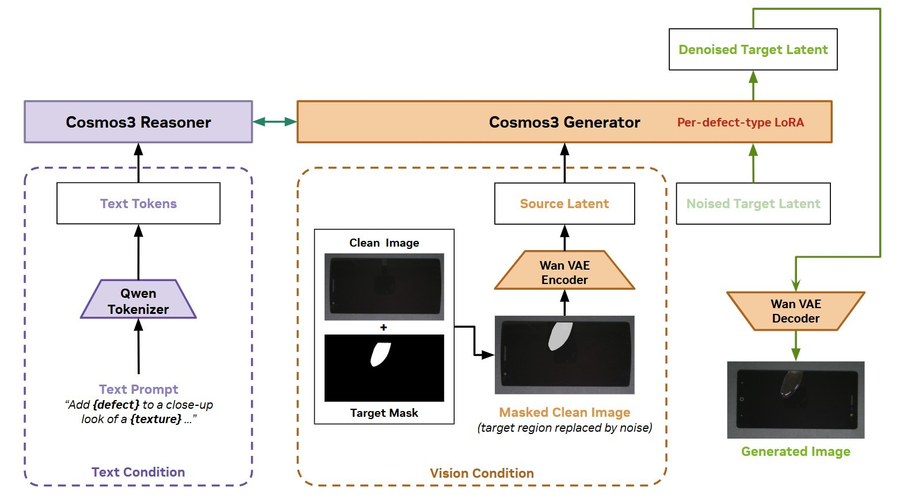

<!--
SPDX-FileCopyrightText: Copyright (c) 2026 NVIDIA CORPORATION & AFFILIATES. All rights reserved.
SPDX-License-Identifier: Apache-2.0

Licensed under the Apache License, Version 2.0 (the "License");
you may not use this file except in compliance with the License.
You may obtain a copy of the License at

http://www.apache.org/licenses/LICENSE-2.0

Unless required by applicable law or agreed to in writing, software
distributed under the License is distributed on an "AS IS" BASIS,
WITHOUT WARRANTIES OR CONDITIONS OF ANY KIND, either express or implied.
See the License for the specific language governing permissions and
limitations under the License.
-->

# Physical AI Data Factory (PAIDF) AnomalyGen

PAIDF AnomalyGen is a diffusion-based pipeline for **Synthetic Data Generation (SDG)** of anomaly
images in a few-shot scenario. It adapts the base Cosmos generator into an **anomaly-generation**
model for *your* defect types: given a clean product image and a mask marking where a defect
should go, the fine-tuned model paints a realistic defect of the requested type into that region.
Because only a small parameter subset is trained on top of a frozen base network, a handful of real
examples per defect is enough to fine-tune, runs are cheap, and the resulting checkpoints are
tiny — a scalable source of synthetic anomaly data for training downstream defect detectors and
segmenters.

## Overview

**High-level flow:** the texture workflow runs end to end in seven stages, each feeding the next.

1. **Dataset preparation** — turn an upstream source into the `anomaly_image/` + `mask/` +
   `clean_image/` layout the trainer expects.
2. **Auto mask placement (AMP)** — decide where each defect goes and place its mask on the clean
   images, building the `testcase.jsonl` that fine-tuning and generation consume.
3. **Fine-tuning** — train the model on the `anomaly_image/` + `mask/` pairs.
4. **Generation (SDG)** — run the fine-tuned checkpoint over a batch of testcases to synthesize
   defect images.
5. **Evaluation** — score the batch against real references with the KPI. Optionally filter it into
   a clean `keep/` set.
6. **Quality refinement** — search per-sample generation parameters over repeated
   draw → generate → evaluate rounds, then keep the best variant of each sample.
7. **Pseudo-labeling** — turn the refined batch into a labeled dataset: a COCO instance dataset, a
   per-class classification layout, and optional captions.

Zooming into Generation (SDG) — the path a single image takes at generation time, once the
per-defect-type LoRA is trained:



Generation is conditioned on two things at once. The **text condition** turns a prompt into tokens
for the VLM. The **vision condition** takes a clean image plus a target mask, replaces the masked
region with noise, and encodes it into a source latent. The Diffusion model — frozen, with a small
per-defect-type LoRA on top — denoises the target latent from both, and the VAE decoder turns it
back into an image with the defect painted into the masked region.

## Installation

**Requirements:**

- NVIDIA driver supporting CUDA 13.2, and a **visible GPU at build time** — some of the compiled
  CUDA extensions autodetect the target arch, and silently build without GPU kernels if they cannot
  see one.
- A host C/C++ toolchain (`gcc`/`g++`) and `git` — several dependencies are compiled from source
  or installed straight from a git URL.

### Get the source

```shell
git clone https://github.com/NVIDIA/paidf-anomalygen.git
cd paidf-anomalygen
```

### Virtual environment

Install [`uv`](https://docs.astral.sh/uv/getting-started/installation/) as the virtual environment manager.

```shell
curl -LsSf https://astral.sh/uv/install.sh | sh
```

Build the venv:

```shell
# MAX_JOBS: parallel compile jobs (default 16)
# NVCC_THREADS: threads per nvcc invocation (default 1)
bash scripts/env_setup.sh [MAX_JOBS] [NVCC_THREADS]
```

Then authenticate to Hugging Face, fetch the model checkpoints, and confirm the environment is
sound. The checkpoints are gated, so **accept both the `nvidia/Cosmos3-Nano` and
`nvidia/Cosmos3-Edge` licenses on Hugging Face** with the same account before downloading:

```shell
source .venv/bin/activate
hf auth login                   # or: export HF_TOKEN=<your-hf-token>
bash scripts/download_checkpoints.sh
scripts/preflight_env_ckpt.sh   # GPU, Python, CUDA/torch, deps, HF auth, checkpoints
```

### Docker

A prebuilt image is published publicly on
[NGC](https://catalog.ngc.nvidia.com/orgs/nvidia/containers/paidf-anomalygen) — no registry
login required:

```shell
docker pull nvcr.io/nvidia/paidf-anomalygen:1.1.0
```

The tag tracks this repo's `VERSION`. If it is not yet on the
[tag list](https://catalog.ngc.nvidia.com/orgs/nvidia/containers/paidf-anomalygen/tags), that version
has not been released yet — **build the image from this checkout rather than pulling an older tag**.

Building — including the `develop` / `product` / air-gapped targets — is covered in
[docker/README.md](docker/README.md).

## Usage

### Tutorial

An end-to-end walkthrough of the pipeline above — from a clean environment to a filtered,
pseudo-labeled set of synthetic anomalies — lives under `docs/tutorial/texture/`. Start at
[1 · Overview & Environment Setup](docs/tutorial/texture/1-overview.md), which explains what you will
build and sets up the environment (venv or Docker, checkpoints, smoke test). The pages:

1. [Overview & Environment Setup](docs/tutorial/texture/1-overview.md) — install and smoke test.
2. [Dataset Preparation](docs/tutorial/texture/2-dataset-preparation.md) — build the dataset layout.
3. [Auto Mask Placement](docs/tutorial/texture/3-auto-mask-placement.md) — place defect masks to build the testcases.
4. [Fine-tuning](docs/tutorial/texture/4-fine-tuning.md) — train the per-defect-type LoRAs.
5. [Generation](docs/tutorial/texture/5-generation.md) — generate synthetic anomalies from the fine-tuned checkpoint.
6. [Evaluation, Refinement & Pseudo-labeling](docs/tutorial/texture/6-evaluation-and-refinement.md) — evaluate, filter, refine & pseudo-label.

### Agent skills

The pipeline ships as [agent skills](skills/) so an AI coding agent can drive it end to end, with the
per-stage gates and failure modes encoded. Ask for it in plain language and pass the run's parameters
as `key=value` lines. The agent asks for anything required that you leave out, rather than guessing:

```text
Use AnomalyGen skill with
name=phone_screen
mode=full
dataset_dir=datasets/phone_screen
num_sdg=100
max_iter=15000
validation_iter=1000
save_iter=1000
```

That runs all seven stages above. For a single stage, switch `mode` — e.g. `mode=generation_only`
with a `checkpoint=` and `recipe=` from an earlier run generates more images without retraining.

## Contributing

Contributions are welcome. All commits must be signed off under the
[Developer Certificate of Origin](https://developercertificate.org/) — see
[CONTRIBUTING.md](CONTRIBUTING.md) for sign-off instructions and the full DCO text.

## Notice

**NOTICE AND DISCLAIMER:** This software automatically retrieves, accesses or interacts with
external materials. Those retrieved materials are not distributed with this software and are
governed solely by separate terms, conditions and licenses. You are solely responsible for finding,
reviewing and complying with all applicable terms, conditions, and licenses, and for verifying the
security, integrity and suitability of any retrieved materials for your specific use case. This
software is provided "AS IS", without warranty of any kind. The author makes no representations or
warranties regarding any retrieved materials, and assumes no liability for any losses, damages,
liabilities or legal consequences from your use or inability to use this software or any retrieved
materials. Use this software and the retrieved materials at your own risk.
